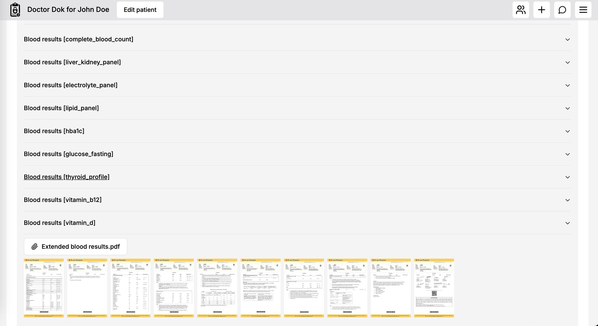
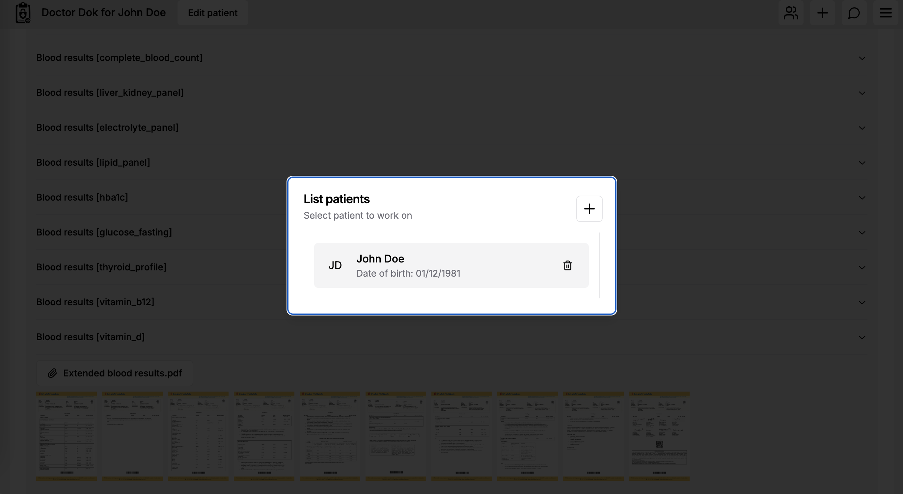
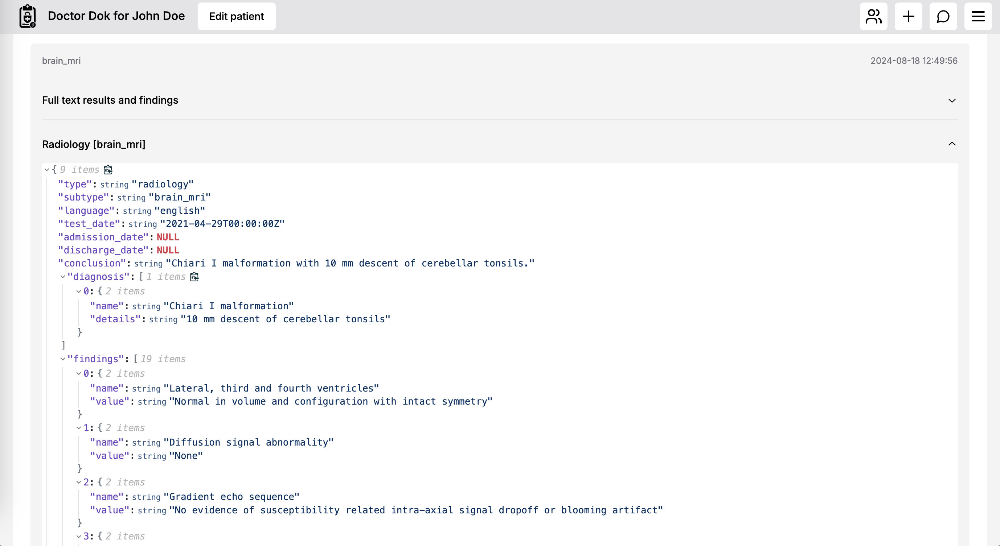
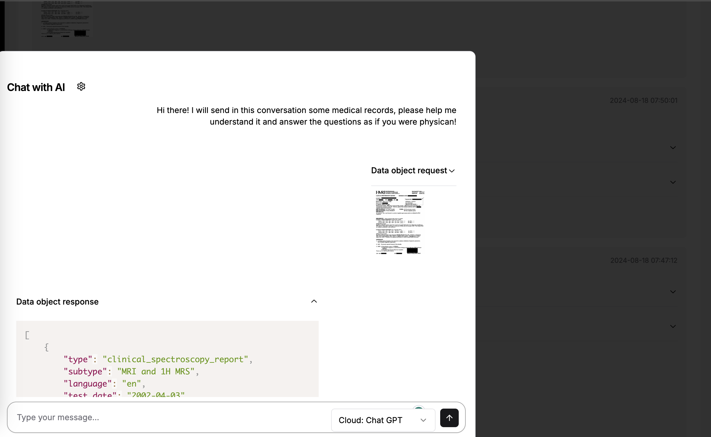
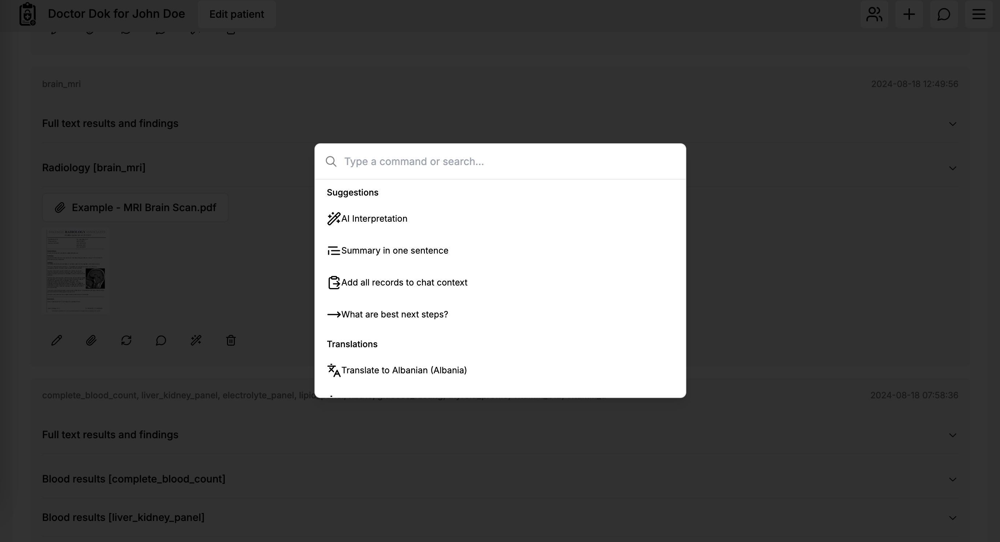

<p align="center">
    
</p>

## Doctor Help

**1 Password + AI untuk Kesehatan**

**Konversi semua Tes Darah, Pemindaian MRI, Pemindaian TK, Laporan Kunjungan, Laporan Rawat Inap ke dalam format JSON, simpan dengan aman di cloud, diskusikan, anotasi, dan terjemahkan dengan AI.**

Doctor Help adalah platform untuk penyimpanan, digitalisasi, berbagi, dan penemuan data kesehatan keluarga atau pasien dengan dukungan AI.

Semua riwayat kesehatan - didigitalisasi - dapat diakses dari mana saja melalui Mobile atau Desktop. Menggunakan AI, kamu dapat **menerjemahkan catatan kesehatan ke dalam lebih dari 50 bahasa** - membuat layanan kesehatan di luar negeri lebih mudah diakses.

Doctor Help menggunakan AI untuk OCR (Optical Character Recognition) bahkan pada foto dokumen kesehatan yang sulit dibaca. Kemudian menyimpan data tersebut di cloud dengan arsitektur khusus (hanya kamu yang bisa mendekripsi data tersebut).

Model AI yang didukung termasuk Chat GPT, LLama 3.1, dan Ollama.

<table>
    <tr>
        <td>
            <a href="readme-assets/screen0.png"></a>
        </td>
        <td>
            <a href="readme-assets/screen1.png"></a>
        </td>
        <td>
            <a href="readme-assets/screen2.png"></a>
        </td>
    </tr>
    <tr>
        <td>
            <a href="readme-assets/screen3.png"></a>
        </td>
        <td>
            <a href="readme-assets/screen4.png"></a>
        </td>
        <td>
            <a href="readme-assets/screen5.png"></a>
        </td>
    </tr>
</table>

**Dengan menggunakan AI Chat, seseorang dapat menganalisis riwayat medis bertahun-tahun dalam hitungan detik**, memformulasikan opini kedua, memeriksa perawatan yang mungkin, memeriksa interaksi obat, dll.

## Fitur Utama:

- Mendigitalisasi semua data kesehatan kamu - bahkan scan yang buruk, mengonversinya ke data terstruktur JSON,
- Chat dengan AI dengan memilih atau semua catatan kesehatan kamu dalam konteks,
- Menerjemahkan catatan kamu ke lebih dari 50 bahasa,
- Mendukung model AI seperti Chat GPT, LLama 3.1, dan model Ollama lainnya,
- Mendukung OCR Tesseract sebagai alternatif,
- Mendukung format PDF, PNG, JPG, TIFF, Teks,
- Penyimpanan data dalam format JSON standar,
- Mendukung lampiran multi halaman,
- Mendukung semua jenis catatan medis: Hasil darah, Pemindaian MRI, Pemindaian RTG, Laporan Pasca-Kunjungan, dll.,
- Mendukung multi pasien,
- Penghapusan PII (Informasi Identitas Pribadi) menggunakan AI atau daftar hitam,
- Enkripsi data end-to-end,
- Berbagi aman dengan keluarga, dengan dokter, dll. - menggunakan fitur Kunci Berbagi,
- Akses dari Mobile atau Desktop,
- Mendukung tema gelap dan terang,
- API REST penuh dengan otorisasi JWT untuk mengelola `pasien`, `rekaman pasien`, `lampiran terenkripsi`, integrasi AI, dan lainnya.
- Teknologi stack 100% TypeScript, Next JS, React + Shadcn-ui.

## Kasus Penggunaan
- **Pengguna akhir** - menggunakan Doctor Help sebagai cloud AI kesehatan,
- **Penyedia medis** - menggunakan Doctor Help sebagai kerangka kerja EHR yang aman dengan berbagi per-pasien,
- **Teknologi medis** - menggunakan Doctor Help sebagai kerangka kerja untuk pengembangan produk.

## Data Terstruktur

Doctor Help menggunakan format JSON standar untuk mengurai semua catatan kesehatan yang dimasukkan. Dengan melakukan ini, membuka jalan bagi fitur-fitur baru yang menarik seperti peringkasan data, diagram, kompresi data, bahkan menyertakan riwayat kesehatan bertahun-tahun dalam konteks AI. Hal-hal yang sebelumnya sangat sulit atau bahkan tidak mungkin dilakukan oleh manusia.

## Penyimpanan Terenkripsi

Semua catatan kesehatan (termasuk lampiran file) **dienkripsi di browser** sebelum dikirim ke server. Kunci pribadi kamu tidak pernah ditukar dengan server. Oleh karena itu, tidak ada cara untuk mengakses, mengambil alih, atau memodifikasi data. Satu-satunya pengecualian adalah jika kamu memutuskan untuk menggunakan Chat GPT yang mendukung proses penguraian data, peringkasan, konteks, dan pengambilan kesimpulan. Meskipun demikian, kamu harus memasukkan kunci API Chat GPT kamu sendiri dan data dikirim langsung dari browser kamu ke chatGPT sesuai dengan [kebijakan privasi OpenAI](https://openai.com/pl-PL/policies/eu-privacy-policy/).

## Memulai

Hampir tidak ada dependensi eksternal. Aplikasi ini menggunakan SQLite untuk menyimpan basis data per pengguna dari pasien dan catatan kesehatan. Untuk memulai aplikasi cukup jalankan:

```bash
yarn dev
```

Buka http://localhost:3000 dengan browser kamu untuk melihat hasilnya.

Untuk menggunakan fitur AI pastikan kamu mengatur kunci API Chat GPT kamu di pengaturan.

Pengaturan ENV yang tersedia (menggantikan pengaturan UI):

```js
export const ENV_PROVIDED_CONFIG = {
  chatGptApiKey: process.env.NEXT_PUBLIC_CHAT_GPT_API_KEY,
  displayAttachmentPreviews: process.env.NEXT_PUBLIC_DISPLAY_ATTACHMENT_PREVIEWS,
  ocrProvider: process.env.NEXT_PUBLIC_OCR_PROVIDER,
  ocrLanguage: process.env.NEXT_PUBLIC_OCR_LANGUAGE,
  ollamaUrl: process.env.NEXT_PUBLIC_OLLAMA_URL,
  ollamaModel: process.env.NEXT_PUBLIC_OLLAMA_MODEL,
  llmProviderChat: process.env.NEXT_PUBLIC_LLM_PROVIDER_CHAT,
  llmProviderParse: process.env.NEXT_PUBLIC_LLM_PROVIDER_PARSE,
  llmProviderRemovePII: process.env.NEXT_PUBLIC_LLM_PROVIDER_REMOVE_PII,
  piiGeneralData: process.env.NEXT_PUBLIC_PII_GENERAL_DATA
}
```
